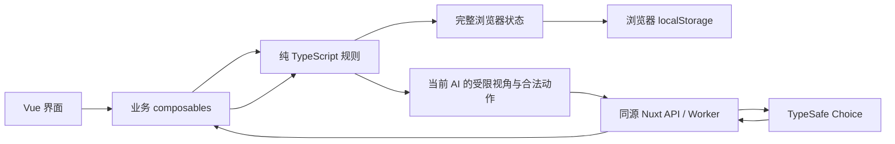

# UnoJev v1 规格

状态：产品方向已确认，可据此进入实现；文中标明的 v1 默认值是本次补齐的实施选择。游戏、真实 Jev 调用和部署均未实施。

核对日期：2026-09-19。产品名为 **UnoJev**，GitHub 仓库名为 `uno-jev`。本文件维护 v1 行为与接口合同，README 和文档索引只提供概览与入口。

## 范围与非目标

| 项目 | v1 约定 |
|---|---|
| 参与者 | 固定 4 个座位，`p0` 为真人，`p1`、`p2`、`p3` 为 Jev AI 对手，默认名称为“你”“Jev 1”“Jev 2”“Jev 3”。 |
| 胜负 | 单局先出完手牌者获胜，不计算累计 500 分；结束后可另开一局。 |
| 游戏规则 | 108 张经典基础牌，支持 UNO 宣告；禁用 `+2/+4` 叠加、抢出、7-0、交换手牌和自定义牌。具体取舍见下文。 |
| 客户端 | Nuxt 4、Vue 3、TypeScript，Composition API 与 `<script setup lang="ts">`；通用浏览器能力优先使用 VueUse。 |
| 界面 | 默认简体中文，DOM / CSS / SVG 卡牌，Vue 内置过渡；桌面和手机可用。 |
| 样式 | `@ayingott/theme` + Tailwind CSS，Paper 浅色与 Ink 深色；不使用 brutal 风格、UnoCSS 或新增 UI 组件框架。 |
| 服务端 | Nuxt server API 随应用部署到 Cloudflare Workers，只代理受限的 Jev 决策请求。 |
| 存储 | 浏览器 storage 保存一个对局槽位和偏好；不使用 D1、其他数据库或服务端对局持久化。 |

v1 不包含真人联机、房间、账号、云同步、排行、比赛计分、AI 难度档位、聊天、长篇推理解释、回放系统或 PWA 离线安装。网络不可用时，已加载页面可以用明确标识的规则策略继续游戏；不承诺离线冷启动。

Jev 负责在合法动作中作选择，实际对战强度尚未实测。不得宣传已验证的策略水平、胜率或响应时间保证。

## 游戏规则

规则依据为 [Mattel UNO Basic 官方说明](https://service.mattel.com/instruction_sheets/UNO%20Basic%20IS.pdf)的基础玩法部分。同一说明中的 Progressive、Seven-O 和 Jump-In 属于 house rules，均不启用。下文明确标出的取舍是 UnoJev v1 的产品默认值，不冒充官方机制。

### 牌组、座位与开局

每种颜色为红、黄、绿、蓝之一，各有 1 张 `0`、各 2 张 `1` 至 `9`，以及各 2 张 Skip、Reverse、Draw Two；另有 4 张 Wild 与 4 张 Wild Draw Four，共 108 张。不加入新版牌盒中的额外牌。

每个实体牌实例有唯一且稳定的 `CardId`，同面值的两张牌仍是不同实例。牌组目录由规则代码维护，ID 不编码洗牌后的顺序。洗牌使用 Fisher-Yates，随机输入由外部注入以便测试；对局保存实际顺序，不能只保存种子。

座位顺序固定为 `[p0, p1, p2, p3]`，`direction = 1` 表示沿数组前进，视为庄家左侧方向；`-1` 表示反向。v1 均匀随机选庄家，省略官方先抽牌比大小的仪式，这是减少开局操作的产品取舍。每人发 7 张，再从抽牌堆翻起始牌。庄家、牌序和起始牌效果均在创建存档前确定。

| 起始牌 | 处理方式 |
|---|---|
| 数字牌 | 以该颜色开局，庄家左侧玩家先行动。 |
| Skip | 跳过庄家左侧玩家，由其下一位行动。 |
| Reverse | 方向改为 `-1`，庄家先行动，然后沿反方向继续。 |
| Draw Two | 庄家左侧玩家先抽 2 张并跳过，由其下一位行动。 |
| Wild | 庄家左侧玩家先选颜色，然后仍由该玩家正常行动。选色属于独立开局阶段。 |
| Wild Draw Four | 不进入弃牌堆、不产生罚牌。先从剩余非 `+4` 牌中确定替代起始牌，再将被翻出的 `+4` 放回剩余抽牌堆洗匀，避免反复抽到同一张的循环；这是对官方“放回并重抽”的具体实现约定。 |

### 普通回合与功能牌

每个正常回合只能出 1 张牌。普通有色牌匹配当前颜色，或匹配顶牌的数字 / 功能符号即可出；顶牌为 Wild 类时，以已选定的 `currentColor` 为颜色依据。Wild 可在有其他可出牌时使用。

玩家可以选择不出已有的合法牌，此时必须抽 1 张。抽到的牌可出时，可以立即出这张牌，也可以保留并结束回合；不能再出抽牌前已有的手牌。抽到不可出的牌则直接结束回合，不持续抽到能出为止。罚抽不产生出牌机会。

| 牌 | 效果与限制 |
|---|---|
| Skip | 当前方向的下一位跳过一次行动。 |
| Reverse | 翻转方向，按新方向选择下一位；固定四人对局中不把 Reverse 当 Skip。 |
| Draw Two | 下一位抽 2 张并跳过。可按颜色或 Draw Two 符号匹配出牌，但受罚者不能用另一张 `+2` 接牌。 |
| Wild | 提交出牌时选择红、黄、绿、蓝之一，可继续当前颜色。 |
| Wild Draw Four | 出牌前，手中不能有任何与当前颜色相同的有色牌；同数字、同功能但不同颜色的牌，以及普通 Wild，都不阻止使用。出牌时选颜色，下一位抽 4 张并跳过。 |

`+4` 合法性检查使用**出牌前的当前颜色与整手牌**，包括刚抽到的牌，而非即将选择的新颜色。非法牌不出现在候选列表中，直接提交非法动作也必须被规则引擎拒绝。

官方允许被 `+4` 针对的玩家质疑：出牌者只向质疑者展示手牌；若违规，出牌者承担 4 张，若合法，质疑者承担 6 张。**v1 不开放虚张声势或质疑动作**：真人与 AI 都无法提交非法 `+4`，质疑无法成功，还会要求向另一位 AI 暴露手牌，与本项目的信息边界冲突。界面规则说明应明确“系统校验 `+4`，本版不提供质疑”，不能暗示完整实现了官方质疑流程。

### UNO 宣告与抓漏

官方要求在打出倒数第二张牌时宣告 UNO；未喊且被其他玩家在下一位开始回合前抓到，罚抽 2 张。单纯曾经没喊，不构成跨回合追罚依据。

v1 用出牌动作上的 `declareUno` 表达宣告。真人剩 2 张、将出到剩 1 张时，可以在选牌后使用“UNO 并出牌”；普通“出牌”仍可用，但代表未宣告。抽 1 张后再出到剩 1 张的情形也适用。选择 Wild 颜色后再提交，宣告与出牌一并生效。

**v1 默认 AI 总会宣告，也总会在转交回合前抓到真人漏喊**。漏喊、AI 抓漏及真人罚抽 2 张在同一动作内结算，公开记录抓漏者和罚牌数；抓漏者固定为当前方向的下一位 AI。界面提前说明这一规则，不设计倒计时、补喊竞速、AI 随机忘喊或真人抓 AI 漏喊按钮。这是数字交互与对手行为的取舍，官方的处罚条件和数量保持不变。AI 的宣告和抓漏由代码执行，不另付费询问 Jev，也不为漏喊增加候选动作。

玩家因抽牌重新持有超过 1 张时，清除其宣告状态；之后再出到剩 1 张必须重新宣告。误在其他手牌数量下携带 `declareUno: true` 的动作应被拒绝。

### 结算顺序、末张牌与牌堆耗尽

一次出牌按以下顺序原子结算：验证动作，移牌并设置颜色 / 方向，处理 UNO 宣告或抓漏罚抽，处理功能牌对下一位的影响，判断胜负并确定下个可行动玩家。罚抽和跳过不等待另一个网络请求，也不允许中途插入普通出牌。

数字牌、Wild、Skip、Reverse、`+2`、合法 `+4` 都可作为末张牌。末张为 `+2/+4` 时，仍先让受影响的下一位完成罚抽，再进入结束状态；末张 Reverse 仍更新方向，Skip 仍记录跳过效果，但不会再启动下一回合。剩 1 张直接出完不需要再次宣告 UNO。v1 不做计分，仍保留这些结算效果。

每次需要抽牌时，若抽牌堆不足，先抽完现有牌，再保留弃牌堆顶牌，将其余弃牌洗成新抽牌堆，继续抽足数量。当前颜色不因重洗改变，也不重新触发顶牌效果。

极端情况下若连可回收弃牌也没有，只抽实际可用的数量，记录应抽数与实抽数，罚牌造成的跳过照常生效，不记后续欠牌。正常回合抽不到牌时结束该回合。若连续 4 个正常回合都因抽不到牌而结束，期间没有任何出牌或成功抽牌，结束为无胜者和局；主动放弃已有合法牌后抽空堆也计入，任何成功移牌都重置计数。只有 `turn` 中 `draw-one` 实抽为 0 才增加计数，`keep-drawn` 不增加，因为该回合已经抽到过牌。这是官方说明未细化的资源耗尽兜底，防止无限空转，不是常规胜负规则。

## 领域模型与状态机

规则层使用可 JSON 序列化的数据与判别联合，不依赖 Vue、VueUse、DOM、storage、网络或系统时钟。随机洗牌输入也从调用方传入，测试可替换为固定序列。以下是实现合同，字段名可沿用，字段含义和不变量不能被省略。

| 类型 / 字段 | 约定 |
|---|---|
| `Color` | `red`、`yellow`、`green`、`blue`。 |
| `Card` | 稳定 ID 加牌面；数字为 `0..9`，功能为 `skip`、`reverse`、`draw-two`、`wild`、`wild-draw-four`。Wild 类无固有颜色。 |
| `Player` | 固定 ID、`human/jev` 类型、显示名称、完整 `hand: CardId[]`、`unoDeclared: boolean`。不另存可由手牌长度推导的数量。 |
| `GameState.gameId` | 每次新局生成新 UUID，不跨新局复用。 |
| `rulesVersion` | 固定为 `classic-single-v1`，覆盖本规格中的明确取舍。 |
| `revision` | 从 `0` 开始，每次成功提交动作加 `1`；同一动作内的罚抽、抓漏、结算只加一次。 |
| `players`、`dealerId` | 固定座位顺序和庄家；必须恰好 1 位真人、3 位 AI。 |
| `drawPile`、`discardPile` | 完整有序 `CardId[]`；抽牌堆末项先抽，弃牌堆末项为顶牌。 |
| `currentColor` | 当前有效颜色；仅 `opening-color` 阶段可以为 `null`。 |
| `direction`、`currentPlayerId` | `1/-1` 和当前行动者；结束阶段保留最后行动者，仅供显示。 |
| `phase` | 下表的判别联合，包含该阶段恢复所需的附加数据。 |
| `blockedTurnCount` | 连续抽不到牌且未出牌的正常回合数，运行中为 `0..3`，第 4 次转入和局。 |
| `recentEvents` | 最多 50 条公开事件，包括出牌、选色、抽牌数量、跳过、宣告、抓漏、结束，以及 AI 决策来源；不记录抽到的暗牌牌面。不是完整回放。 |

所有 108 个牌 ID 在手牌、抽牌堆、弃牌堆的并集中恰好出现一次；ID 与牌面由固定牌组目录对应，存档不能添加自定义牌。弃牌堆始终非空，除开局选色外，当前颜色必须有效。有色顶牌的颜色必须与当前颜色一致。未结束时任何玩家手牌都非空，UNO 状态须与剩 1 张及已结算宣告相符。

| 阶段 | 合法动作 | 转移 |
|---|---|---|
| `opening-color` | 庄家左侧玩家 `choose-opening-color(color)`。 | 保存选色，进入同一玩家的 `turn`。AI 从 4 个颜色候选中选。 |
| `turn` | `play(cardId, chosenColor?, declareUno)` 或 `draw-one`。即使可出牌，也允许抽 1 张。 | 出牌结算后进入下位 `turn` 或 `finished`；抽到可出牌则留在本人 `after-draw`，否则转下位。 |
| `after-draw` | 只可 `play(drawnCardId, ...)` 或 `keep-drawn`，该阶段存储 `drawnCardId`。 | 出牌结算或保留后进入下位 `turn`，可能结束游戏。不能再抽或换出旧手牌。 |
| `finished` | 无对局动作；另开新局属于会话操作。 | 保存 `{ winnerId, reason: 'empty-hand' }` 或 `{ winnerId: null, reason: 'blocked' }`。 |

阶段与动作采用以下 JSON 形状，`PlayerId` 为 `p0..p3`，`CardId` 为牌组目录的稳定字符串：

```ts
type GamePhase =
  | { kind: 'opening-color' }
  | { kind: 'turn' }
  | { kind: 'after-draw'; drawnCardId: CardId }
  | {
    kind: 'finished'
    result:
      | { reason: 'empty-hand'; winnerId: PlayerId }
      | { reason: 'blocked'; winnerId: null }
  }

type LegalAction =
  | { type: 'play'; cardId: CardId; chosenColor?: Color; declareUno: boolean }
  | { type: 'draw-one' }
  | { type: 'keep-drawn' }
  | { type: 'choose-opening-color'; color: Color }
```

`chosenColor` 对 Wild 类出牌必填，对普通有色牌禁止携带，由规则校验结合牌组目录判断。宣告布尔值必填，AI 候选仅在本次出牌后剩 1 张时取 `true`。`GameState.phase` 使用 `GamePhase`；网络 `AiView.phase` 只发送可决策的 `kind` 字符串，并在抽后阶段单独带 `drawnCardId`，结束状态不请求 AI。

牌堆耗尽引起的重洗、起始 Skip / Reverse / `+2`、罚抽、抓漏和结算均是状态转换内部操作，不创建可恢复的“执行了一半”阶段。通常的 Wild 选色属于出牌草稿，选色前不移牌；刷新则放弃草稿，恢复最后一次已提交状态。只有起始牌 Wild 的选色需要独立持久化阶段。

加载中、只读、AI 思考中、动画、存储错误和暂停属于客户端会话状态，不混入规则阶段。动画不得驱动规则转换。页面隐藏时停止启动新 AI 决策，取消在途请求；恢复可见后根据当前持久状态重新调度，不执行后台积攒的动作。

规则模块至少提供创建对局、验证状态、枚举合法动作、应用动作、投影 AI 视角和确定性兜底选择的独立入口。所有动作提交都携带 `actorId`、`gameId` 和 `expectedRevision`，与当前状态不匹配则拒绝，包括真人双击造成的旧操作。应用动作必须重新验证玩家、阶段、牌归属、颜色和宣告条件，返回新状态与公开事件；不能因 UI 曾高亮或 AI 曾返回该动作而跳过验证。

## 模块职责与信任边界

建议沿用 Nuxt 4 目录：纯规则与共享协议放在 `shared/game/`、`shared/ai/`，Vue 界面放在 `app/components/game/`，少量业务 composables 放在 `app/composables/`，HTTP 适配放在 `server/api/ai/decision.post.ts` 和 `server/utils/`。这些路径是后续实施建议，本次不创建应用代码。

| 模块 | 职责与边界 |
|---|---|
| 纯 TypeScript 规则层 | 牌组、洗牌、发牌、合法动作、回合、功能牌、UNO、胜负；不通过网络执行规则。 |
| `useUnoGame` | 持有唯一当前状态，串行提交命令，派生 UI 数据，连接规则与持久化；页面组件不重复实现规则。 |
| `useGamePersistence` | 用 VueUse `useLocalStorage` 保存和恢复快照，校验版本、处理写入失败和多标签页控制权。 |
| `useAiTurn` | 生成当前 AI 视角，调度一次决策，校验过期响应，执行规则策略兜底并标记来源。 |
| 偏好 / 主题 composable | `useLocalStorage` 管理设置，`useColorMode` 管理实际主题，使用 `@vueuse/core` 的明确导入，避免与 Nitro `useStorage` 混淆。 |
| 展示组件 | 桌面牌桌、真人手牌、对手摘要、回合操作和选色面板；接收 props、发出动作意图，不直接修改手牌或存档。 |
| Worker / Nuxt API | 校验受限请求，在服务端构造 Choice，调用 Jev 并规范化返回；不保存对局、不安排下一回合。 |



完整状态仅在玩家浏览器保存。玩家可以通过开发者工具读取或改写全部手牌和抽牌顺序；本项目是单机娱乐，不具备防作弊能力，也没有服务器权威判定。Worker 只能验证请求内部是否自洽，无法证明浏览器是否诚实。多标签页锁、版本号和合法性校验用于避免正常操作下的冲突，不改变这一信任边界。

## AI 决策协议

### 信息投影与候选动作

每次只为当前行动的 AI 请求决策，三个对手不共享私有记忆。`projectForAi(state, actorId)` 通过白名单构造新对象，不使用完整存档展开后删除字段的方式。

| `AiView` 字段 | 内容 |
|---|---|
| `actorId`、`ownHand` | 当前 AI 身份和自己的完整手牌牌面与 ID。 |
| `phase`、`drawnCardId` | 当前决策阶段；只有本 AI 的 `after-draw` 才带刚抽到的牌 ID。 |
| `currentColor`、`direction`、`currentPlayerId`、`dealerId` | 公开回合信息。 |
| `discardPile`、`drawPileCount` | 当前公开弃牌堆的牌面顺序与抽牌堆数量；不提供抽牌堆内容。 |
| `players` | 固定座位 ID、手牌数量和公开 UNO 状态；不含其他玩家手牌、私人草稿或隐藏候选动作。 |
| `recentEvents` | 最近最多 12 条公开规则事件；从本地日志另做白名单投影，排除网络诊断和私有字段。 |

浏览器先用规则引擎枚举合法动作，再附上 `candidates: { id, action }[]`。Worker 根据同一受限视角验证候选动作集合、ID 和动作语义是否一致，重新构造描述；最终仍由浏览器规则引擎验证并执行。

每个候选包含完整动作参数，Wild 的四种选色分别是候选；不能先任意出 Wild 再用不受约束文本选色。AI 的 UNO 宣告由代码补齐，候选不包括故意漏喊。普通回合保留抽 1 张的合法选项，抽后阶段保留 `keep-drawn`。合法候选完整覆盖当前可选动作，不添加 `other` 或虚构动作。

ID 由动作内容生成，例如 `draw_one`、`keep_drawn`、`opening_color_red`、`play_<cardId>_<color-or-none>_<uno-or-no_uno>`。ID 不依赖显示顺序、随机数或模型返回下标；同一快照重复枚举得到相同 ID 和排序，颜色顺序固定为红、黄、绿、蓝。ID 只在匹配的对局与 revision 中生效。

当前牌组最多有 100 张有色牌与 8 张 Wild 类牌，即使宽松计算也不超过 `100 + 8 × 4 + 1 = 133` 个 AI 候选，低于官方 Choice 的 255 选项上限。只有 1 个候选时直接执行并记为 `forced`，不调用 Jev；应可行动却没有候选属于引擎错误，暂停并报告，不能凭空构造出牌。

### 同源 API 合同

浏览器只调用 `POST /api/ai/decision`，JSON 请求的合同如下。`AiView`、`LegalAction` 按上文定义；不接收完整 `GameState`、任意提示词、上游地址或用户指定模型。

```ts
interface AiDecisionRequest {
  protocolVersion: 1
  rulesVersion: 'classic-single-v1'
  gameId: string
  revision: number
  decisionId: string
  actorId: 'p1' | 'p2' | 'p3'
  view: AiView
  candidates: Array<{ id: string; action: LegalAction }>
}

interface AiDecisionResponse {
  protocolVersion: 1
  gameId: string
  revision: number
  decisionId: string
  actorId: 'p1' | 'p2' | 'p3'
  actionId: string
  source: 'jev'
  model: string
}
```

`decisionId` 为每次请求的新 UUID，仅当前页面内存记录它与请求快照的对应关系；不放进对局存档。服务端回显通过验证的关联字段，`model` 取上游实际响应值。成功响应只包含选中 ID 与诊断用模型名，不包含新游戏状态、API key、整份上游响应或伪造的推理过程。返回 `Cache-Control: no-store`。

Worker 限定 POST、JSON 和本站 Origin，拒绝未知字段，检查所有字段的类型、长度和枚举；请求体上限默认 64 KiB，手牌与弃牌 ID 必须有效且互斥，数量与候选必须符合该阶段。`gameId` / `decisionId` 为标准 36 字符 UUID，revision 为非负安全整数，候选数为 `2..133`，候选 ID 为至多 128 字符的 ASCII 标识；牌 ID 必须直接命中固定目录。用户不能通过额外字段让端点变成通用 TypeSafe 代理；Origin 检查不视为身份认证或可靠的付费防滥用措施。

### TypeSafe 适配

采用 [Choice primitive](https://docs.typesafe.ai/primitives/choice)，通过 Worker 的标准 `fetch` 调用 [HTTP API](https://docs.typesafe.ai/api)：`POST https://api.typesafe.ai/v1/systemone`，使用服务端 `Authorization: Bearer <API_KEY>`。v1 默认直接使用 HTTP，避免 SDK 隐含重试改变回合预算。

上游 payload 固定为 `{ model, state, questions }`：`state` 只放经过投影的 AI 视角；`questions.choose_action` 为 `{ type: 'choice', instructions, criteria }`，`criteria` 将每个稳定候选 ID 映射到代码生成的动作描述，包括牌面、选色、宣告及确定的规则效果。服务端固定英文指令要求“只根据可见信息，选择一个候选动作，目标是先出完自己的手牌”，不让模型制定规则或假定知道暗牌。中文 UI 与英文模型指令分开维护。

从 `answers.choose_action.choice` 读取 ID，验证 `type === 'choice'`、选项确实存在，以及模型字段和返回结构有效。若返回的概率 / confidence 字段缺失、不是有限数值或超出 `0..1`，按无效上游结构处理；概率键应恰好覆盖候选，总和与 1 的误差不超过 `1e-6`。默认不把这些数值传给 UI，不因低 confidence 自行改为兜底，也不将其称为胜率。Choice 的概率比较候选选项，confidence 描述分布集中程度，均不是 UNO 对局胜率。

2026-09-19 核对的 [模型文档](https://docs.typesafe.ai/models)列出 `jev-1.13.0`，当时 `jev-latest` 和 `jev-preview` 均指向它。v1 默认固定 `jev-1.13.0`，服务端可用 `NUXT_TYPESAFE_MODEL` 覆盖；实现时应再次核对模型是否仍受支持，并将变更后的默认值同步到本规格。不要根据 cookbook 中的旧示例版本推断当前版本，也不要自动跟随别名升级。

### 超时、兜底与过期响应

Worker 每次上游调用默认 6 秒超时，浏览器同源请求默认总计 8 秒超时；这两个数是产品等待预算，不是已测性能。每个决策最多一次上游请求，同一页面最多一个在途决策，不为三个 AI 并发预请求，不对同一 revision 自动重试。抽到可出牌后进入新 revision，可以再请求一次新的抽后决策。

| 情况 | 对外错误 / 客户端行为 |
|---|---|
| 请求格式或候选不符合合同 | `400 invalid_request`，不调用上游；客户端重新验证当前状态与合法动作，通过则当次兜底，否则暂停并显示规则错误，合同错误进入开发诊断。 |
| 外站 Origin | `403 forbidden_origin`，不调用上游。 |
| 本站边缘限流或上游 `429/529` | `429 ai_rate_limited`，当次由规则策略执行；客户端至少冷却 30 秒，若有有效且更长的 `Retry-After` 则采用它。冷却期的各次 AI 行动均标明兜底。 |
| 服务端缺少 key、上游 `401/403` | `503 ai_unavailable`，当次兜底，本页面会话暂停 Jev 请求，提供“重试 AI”入口，只恢复后续决策，不重放已落地动作。 |
| 上游 `422`、其他错误或返回不符合合同 | `502 ai_invalid_response` / `ai_upstream_error`，当次兜底，下一个决策可再尝试。 |
| Worker 超时 | `504 ai_timeout`，当次兜底。 |
| 浏览器网络错误、8 秒到期 | 取消请求，当次兜底；离线期间直接兜底，恢复网络后的新决策再尝试。 |
| 旧请求、重复响应、已换局或已失去控制权 | 丢弃，不执行，也不触发该旧请求的兜底。 |

错误响应仅给稳定的 `{ error: { code }, decisionId? }` 与必要的 `Retry-After`；不透传上游响应体、请求头、堆栈或配置。即使错误页不是 JSON，客户端也能按网络 / HTTP 失败处理。取消请求不能保证上游尚未计费，不承诺端到端恰好一次调用。

应用响应前，必须同时满足：仍持有本页写权限，页面处于可推进状态，`decisionId` 仍为唯一在途请求，`gameId`、`revision`、行动者和阶段与请求快照一致。随后以**当前状态重新枚举**合法动作，用 ID 查找，并交给引擎验证。先使本请求失效，再提交一次动作；晚到的成功或失败均无权覆盖结果。新局、刷新恢复、页面隐藏、存档冲突和会话销毁都会取消并作废在途请求。

规则兜底只接收同一 `AiView` 和当前合法候选，不能读取暗牌。固定排序策略为：能立即出完的动作优先；否则优先出牌，按“出牌后该颜色的剩余手牌数降序、牌类 `+4 > +2 > Skip > Reverse > 数字 > Wild`、数字降序、颜色红黄绿蓝、CardId 字典序”打破平局。Wild 的选色按剩余有色手牌数最多优先，平局仍按固定颜色顺序；开局选色同理。无可出牌时选抽牌，抽后只在没有可出候选时保留。策略不调用随机数，相同输入必得相同结果。

公开日志为每次行动标记 `jev`、`forced` 或 `fallback`；兜底同时记录枚举原因，并在该 AI 状态区显示“本次使用规则策略”，成功使用 Jev 后恢复正常标识。强制动作显示“按规则执行”。不把规则策略伪装成 Jev 的选择，不展示未实际生成的解释。

## 浏览器持久化

### 存档格式与恢复

一个同源浏览器只保留一个对局槽位 `unojev:save`，使用如下 envelope。设置独立存储，不因开始新局而清除。

```ts
interface SaveEnvelopeV1 {
  schemaVersion: 1
  savedAt: string // ISO 8601，仅用于显示，不用于解决冲突
  writerId: string // 本页面随机标识，不是账号或设备标识
  state: GameState // 包含 gameId、revision 与全部有序牌堆、手牌、阶段
}
```

`schemaVersion` 表示序列化结构，`rulesVersion` 表示游戏语义。v1 只读取 `schemaVersion: 1` 与 `classic-single-v1` 的组合；本仓库没有旧游戏格式，因此不编写虚构迁移。以后新增版本时，必须提供逐版本的纯迁移函数、固定输入样例和迁移后校验，通过后才替换旧槽位。不能用 `mergeDefaults` 默默补全缺失的游戏字段。

加载流程为：读取原始 JSON，校验版本、字段范围、108 张牌的唯一性与总量、阶段附加字段、当前颜色、玩家 / 宣告状态和结束结果，再进入可交互状态。`after-draw.drawnCardId` 必须在当前手牌中，开局选色必须对应起始 Wild，空手胜者必须唯一；不通过校验就不能请求 AI。未知未来版本、缺字段、坏 JSON 或不自洽存档都保留原槽位并提示“存档无法读取”，由用户选择“清除并新开一局”；不自动重置、不上传原始内容、不循环重试。

首次访问没有存档时展示新局入口，不在 SSR、组件创建或副作用重跑时自动发牌。刷新后可继续已保存的对局；`opening-color` 和 `after-draw` 恢复到原决策点，`finished` 恢复结果页。AI 思考中刷新只恢复提交前快照，取得控制权并选择继续后重新发起新 `decisionId`，不恢复旧 Promise、动画或请求。

### 保存时机与失败处理

用 VueUse [useLocalStorage](https://vueuse.org/core/useLocalStorage/)绑定完整 envelope，在 mounted 后初始化，显式使用对象 serializer，`writeDefaults: false`、`deep: false` 和同步写入时序。游戏通过整体替换新快照提交，不靠深层 watcher 保存每一步手牌变更；非法动作、拖选、动画和网络开始不写存档。VueUse 的相关选项见 [useStorage](https://vueuse.org/core/useStorage/)。

创建新局、开局选色、抽牌进入 `after-draw`、保留抽牌、每次出牌及结束状态都在**引擎完成整次转换后立即保存**，先保存再开放下一操作 / 启动下一 AI 请求。每次转换包含所有连带罚牌，不存在“手牌已减少而惩罚尚未保存”的中间快照。刷新不会再抽一次已抽过的牌或重复结算末张 `+2/+4`。

写入失败时保留旧槽位和本页已经计算的状态，显示“本局暂未保存，刷新会丢失新进度”，暂停自动推进，提供“重试保存”或“仅在此页继续”。重试前检查旧槽位仍匹配本页最后成功保存的 `{ gameId, revision, writerId }`；不匹配则按冲突处理。选择仅此页继续后进入内存模式，不再尝试覆盖原槽位。storage 从一开始就不可用时，同样明确提供临时对局。不能显示虚假的“已保存”。

主题意图单独保存在 `unojev:theme`，取值 `auto/light/dark`；其他偏好保存在 `unojev:settings`，格式为 `{ schemaVersion: 1, reducedMotion: 'system' | 'reduce' }`，默认 `system`。设置可在各标签页同步，非法偏好值回退默认值；这不适用于游戏快照的严格校验。

### 多标签页与冲突

v1 使用同源 [Web Locks API](https://developer.mozilla.org/en-US/docs/Web/API/Web_Locks_API)的独占锁 `unojev:active-game`。控制页在对局会话期间持有锁；其他页显示只读快照和“对局正在另一标签页中进行”，不能发起 AI、修改存档、清除或开始新局。设置不受此锁限制。旧页关闭或主动释放后，另一页可通过“在此页继续”重新争取锁，重新读档再行动；不实现抢占或强制接管。

释放控制权前先停调度、取消请求并作废本页请求代次。页面隐藏仅暂停推进，仍保留控制权；`pagehide`、销毁和返回游戏入口时释放，页面从历史缓存返回必须重新争取锁。内存模式（临时对局 / 仅在此页继续）不读写共享槽位，返回时保留本页内存进度，不重新争取锁；写入失败的对局返回时先重新取锁并核对槽位签名，锁不可用或槽位已变化则不写入、不自动推进，保留未保存的进度由用户选择重试保存、仅在此页继续或重新加载。不能把 `useLocalStorage` 的跨标签页同步等同于并发控制。

每次提交还要在持锁期间比较持久化槽位与最后成功读取 / 保存的 `{ gameId, revision, writerId }`。一旦发现外部修改或删除，停止写入、取消旧请求，提示重新加载最新存档；不能用本页过期内存覆盖。只读页收到 storage 事件时仅更新经校验的显示，不触发游戏动作。新局使用新 `gameId`，替换进行中的唯一槽位前由产品界面确认。

缺少 Web Locks 的浏览器允许查看存档，也可明确选择“不保存的临时对局”，但不读写共享对局槽位来继续游戏；不以 localStorage 时间戳租约模拟可靠互斥。临时对局没有刷新续局承诺。这样无需数据库、心跳锁或多端同步协议，仍能避免两个正常标签页互相覆盖。

## 主题与交互

### Paper / Ink 与资源

2026-09-19 已核对 [主题仓库的 packages/theme](https://github.com/LoTwT/design-system/tree/main/packages/theme)、[npm 发布元数据](https://registry.npmjs.org/@ayingott%2ftheme/0.3.0)及其实际发布包：`@ayingott/theme@0.3.0` 的默认导出为 CSS，peer dependency 是 `tailwindcss: ^4.0.0`。本仓库尚无应用依赖，后续初始化时采用此版本作为已核实基线，并用 lockfile 固定实际安装版本。

全局 CSS 的默认入口为：

```css
@import "tailwindcss";
@import "@ayingott/theme";
```

Tailwind CSS 4 按 [官方 Nuxt 接入指南](https://tailwindcss.com/docs/installation/framework-guides/nuxt)使用 `@tailwindcss/vite` 并注册全局 CSS。不要导入 `@ayingott/theme/brutal.css`，也不要添加 `.brutal`。Paper 使用默认根节点，Ink 在同一 `<html>` 根节点添加 `.dark`。主题包提供 CSS tokens 与基础样式，不提供 Vue 组件库；组件自己使用语义变量，例如 `--surface-canvas`、`--text-primary`。

`fonts.css` 属于可选导出，默认不导入，先使用系统字体栈；这避免中文全量字体增加移动端初次加载体积。卡牌四种游戏颜色独立于页面主题，但两种主题都保留清晰数字、功能符号和颜色文字，不能仅依赖色相辨牌。

用 [useColorMode](https://vueuse.org/core/useColorMode/)应用主题，默认跟随系统。为保持偏好的单一来源，由 `useLocalStorage('unojev:theme', 'auto')` 保存用户意图，`useColorMode` 的内部持久化设为 `storageKey: null`，通过其 `store` 同步意图和实际根节点类。不要再建立第二份主题偏好。预先在首屏绘制前应用已保存意图或系统偏好，避免 SSR / hydration 造成错误主题闪烁；游戏状态仍只在客户端恢复。

### 对局体验

入口提供新局和有效存档的继续入口，规则摘要明确显示单局、无叠加、严格 `+4`、AI 自动抓漏。正在进行的对局展示真人完整手牌、三个对手的牌背 / 数量、弃牌堆顶牌、当前颜色、方向、轮到谁和最近动作。结束页给出胜者或和局原因，以及再来一局的操作。

真人先点选合法牌，再确认出牌；选牌提供可见状态，非法牌可查看不能出的原因。Wild / `+4` 选色面板必须支持键盘和触控，取消不改变状态。抽到可出的牌时明确提供“出这张”和“保留并结束”，其余旧手牌不能提交。手牌剩 2 张时清晰呈现普通出牌与“UNO 并出牌”的区别，避免把宣告藏在小图标中。

桌面采用牌桌布局，手机竖屏保留真人操作区，对手压缩为摘要；大量手牌在独立区域滚动，页面不横向溢出，不能要求悬停或拖拽才能操作。触控目标至少 44 × 44 CSS px，键盘可完成全部真人动作；可见焦点、按钮禁用原因、当前颜色文字和适量 `aria-live` 回合播报在双主题下都可用。

使用 Vue `Transition` / `TransitionGroup` 完成抽牌、出牌和回合提示，默认约 150 至 250 ms，动画不延迟存档；`prefers-reduced-motion` 或用户的减少动态设置关闭位移动画，仍保留状态提示。AI 思考期间显示状态并锁住不属于真人的操作，但允许主题、规则查看和明确的重开操作。兜底标识在日志中持续可见，不能只闪现一次 toast。

## 本地配置与部署

以下仅为后续实现示例，不表示已有配置文件或可以启动应用。根目录 `.env` 约定为：

```dotenv
NUXT_TYPESAFE_API_KEY=
NUXT_TYPESAFE_MODEL=jev-1.13.0
```

已有本地密钥不应被覆盖、复制到文档 worktree 或提交。核对时原工作目录的 `.env` 已存在且被 `.gitignore` 中的 `.env` / `.env.*` 规则忽略，`.env.example` 为例外；独立 worktree 不保证包含尚未提交的忽略文件。实际开发环境须在放入密钥前确认忽略规则，可用 `git check-ignore -v .env`，不输出密钥值。可提交的 `.env.example` 只保留空密钥占位。

按照 [Nuxt runtimeConfig](https://nuxt.com/docs/4.x/guide/going-further/runtime-config)约定，私有配置声明为：

```ts
export default defineNuxtConfig({
  runtimeConfig: {
    typesafeApiKey: '',
    typesafeModel: 'jev-1.13.0',
  },
})
```

server route 用 `useRuntimeConfig(event)` 读取私有字段，通过匹配的 `NUXT_TYPESAFE_API_KEY` 和 `NUXT_TYPESAFE_MODEL` 在运行时注入。不要把真实 key 写成配置默认值、放入 `public` / `app` runtime config、Vite define、客户端 bundle、SSR payload、storage、日志或请求响应。此处“请求响应”指浏览器与本站 API；Worker 到 TypeSafe 的认证请求头是唯一允许携带 key 的业务网络出口。

生产使用 [Cloudflare Worker Secret](https://developers.cloudflare.com/workers/configuration/secrets/)配置 `NUXT_TYPESAFE_API_KEY`；模型名是普通服务端配置。生产 Worker 不依赖本地 `.env` 文件，也不把 key 放进 `wrangler.jsonc` 的公开 `vars`。依据 [Cloudflare Nuxt Workers 指南](https://developers.cloudflare.com/workers/framework-guides/web-apps/more-web-frameworks/nuxt/)选择与实际 Nuxt / Nitro 版本匹配的适配配置；当前指南使用 `cloudflare` preset 与 Workers Assets，不是纯静态导出后直接访问 TypeSafe。

SSR 只输出外壳和非对局内容；发牌、storage 访问及 AI 调度在客户端初始化之后进行。Worker 不保留游戏快照、会话房间或玩家身份。日志只允许错误码、耗时、模型名、请求关联 ID 和 token 数等必要诊断，不打印 Authorization、完整 runtimeConfig、上游原始错误或完整手牌 payload。公开部署时在 Cloudflare 边缘配置端点限流，并验证超限也能按兜底流程继续。

## 验收标准与测试计划

以下全部为后续实现验收项，本次文档更新不代表已经通过游戏测试。规则测试使用固定牌序 / 随机输入，网络测试使用 mock，不依赖 API key 或消耗额度。

| 编号 | 验收场景 |
|---|---|
| R1 | 108 张牌的组成、实体 ID 唯一性、洗牌不丢不增、4 人各 7 张；逐一覆盖数字 / Skip / Reverse / `+2` / Wild / `+4` 起始牌，包括多张起始 `+4`。 |
| R2 | 同色、同数、同符号与 Wild 的合法性；两个方向跨 `p3/p0` 的回合切换，Skip 跳过一次，四人 Reverse 翻向，罚抽后跳过且不可叠加。 |
| R3 | 有合法牌仍可抽 1 张；抽到可出牌后的“出 / 留”、不可出自动结束、禁止出旧手牌、禁止连抽和罚抽后出牌。 |
| R4 | `+4` 的同色禁止、同数字异色允许、普通 Wild 不阻止、抽牌后检查全手牌，以及 currentColor 与 Wild 印刷牌面不同的情况；无质疑候选。 |
| R5 | 真人宣告、漏喊被 AI 抓漏罚 2、抽后出到剩 1、再次宣告、错误宣告被拒、AI 始终宣告；不得在下一回合追罚。 |
| R6 | 每类末张牌、最后 `+2/+4` 先罚抽后结束、胜者唯一、结束后无动作；不执行 500 分累计。 |
| R7 | 抽牌堆刚好耗尽、罚抽中途重洗、保留顶牌 / 当前颜色、牌数守恒；无可回收牌时实际罚抽与 4 回合无进展和局。 |
| S1 | 各可持久阶段往返序列化后牌堆顺序、手牌、合法动作、颜色、方向、当前玩家、UNO 与结果完全一致；刷新不重复抽牌或结算。 |
| S2 | 未知版本、坏 JSON、重复 / 缺失牌、错误阶段字段和错误胜者均拒绝；旧槽位不被默认值覆盖。未来迁移需有固定样例。 |
| S3 | 动作后立即保存；模拟 quota / storage 禁用、重试与临时模式，显示真实保存状态；新局不清设置。 |
| S4 | 两标签页同时打开 / 开新局 / 请求 AI、控制页关闭 / 隐藏 / 历史缓存恢复、外部删改槽位；至多一个写者，旧请求不能覆盖新状态；无 Web Locks 时只允许临时游戏写内存。 |
| A1 | 在其他玩家手牌和抽牌堆植入标记，检查投影、HTTP body、服务端上游 payload、日志均无这些暗牌内容；多次决策不共享 AI 私有状态。 |
| A2 | 候选完整且 ID 稳定，Wild 选色在候选内，单候选不联网；伪造 ID、动作参数、未知字段、过大 body 或其他玩家 action 均不能生效。 |
| A3 | Mock 成功、429、529、401、422、5xx、非 JSON、字段缺失、非法数值、6/8 秒超时、断网、重复及乱序返回；该兜底时只执行一次，过期时既不执行也不兜底。 |
| A4 | 相同视角得到相同兜底动作；每次兜底 / forced 来源明确；重开、刷新、隐藏或失去控制权后旧响应无效。 |
| A5 | 使用假的密钥标记检查客户端 bundle、SSR payload、浏览器存储与网络响应不含它；Worker 运行时可读取私有配置，缺配置走受控错误。 |
| U1 | 至少覆盖 360 × 800 手机竖屏、800 × 360 横屏和 1440 × 900 桌面；大量手牌、选色和结算不遮挡关键操作，键盘与触控可完成一局。 |
| U2 | Paper / Ink / 跟随系统及刷新持久化，首屏无错误主题闪烁；色彩之外有符号 / 文字、焦点可见、减少动态有效。 |
| D1 | Nuxt 构建产物在 Worker 本地预览可提供页面与同源 API；无数据库绑定、无客户端直连 TypeSafe；错误日志和接口不泄露 key。 |

规则层优先使用单元测试验证状态转换与不变量，composables 用集成测试覆盖保存和调度，浏览器测试覆盖跨标签页、刷新和关键交互；不以快照测试代替规则断言。真实 API 的最小联通、延迟、费用和对战策略质量验证属于后续集成工作，本次不执行。即使以后联通通过，也不能据此声称 Jev 已具备特定胜率。

## 建议实施顺序

1. 初始化 Nuxt 4 / Vue 3 / TypeScript，接入 Tailwind CSS 4、已核实的主题和 VueUse，建立空密钥示例、忽略规则和 Worker 配置；以 mock API 开发。
2. 完成纯规则引擎、固定牌组与 `R1..R7`。先验证严格 `+4`、UNO 抓漏和末张结算，再连接 UI。
3. 完成存档校验、串行提交、多标签页控制和 `S1..S4`，确保可从每个决策阶段恢复。
4. 实现双主题牌桌与真人完整流程，用确定性规则策略暂代三个对手；接通投影、稳定 ID 与可见决策来源。
5. 实现 Worker Choice 适配、响应防过期、超时与兜底，以 mock 完成 `A1..A5`，再完成移动端和 Worker 预览验收。
6. 在后续集成任务中安排小范围真实 API 验证，记录模型实际版本、失败率、延迟与成本；完成发布准备后另行部署。
